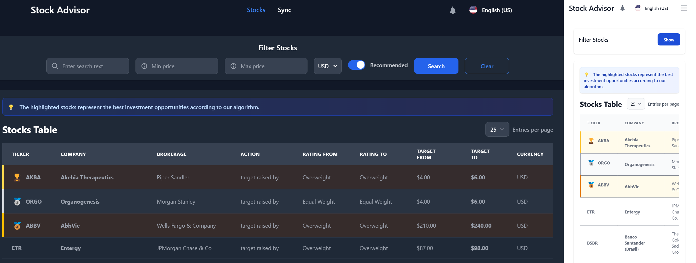

# Stock Advisor

Stock Advisor is a modern web application designed to visualize, filter, and analyze stock market data. The application provides an intuitive interface for users to search, filter, and get recommendations for potential investment opportunities.



## Features

- **Advanced Stock Filtering**: Search and filter stocks by ticker, company, price range, and more
- **Recommendation Algorithm**: Intelligent analysis of stock ratings and price targets
- **Responsive Design**: Fully responsive interface that works on mobile, tablet, and desktop
- **Real-time Data Synchronization**: Update stock information from external sources
- **Multi-language Support**: Available in English and Spanish
- **Dark/Light Mode**: Automatically adapts to system preferences
- **Modern UI/UX**: Clean, intuitive interface with Tailwind CSS and Flowbite components

## Requirements

- Node.js 22.0+ (recommended)
- Modern web browser (Chrome, Firefox, Edge, Safari)
- API backend [julianloaiza/stock-advisor-backend](https://github.com/julianloaiza/stock-advisor-backend)

## Installation

Clone the repository and install dependencies:

```bash
# Clone the repository
git clone git@github.com:julianloaiza/stock-advisor-frontend.git
cd stock-advisor

# Install dependencies
npm install

# Create .env file from example
cp .env.example .env
```

Configure your environment variables in the `.env` file:

```
VITE_API_BASE_URL=http://localhost:8080
VITE_DEFAULT_LANGUAGE=EN
```

> Note: VITE_DEFAULT_LANGUAGE can be set to 'EN' or 'ES' to define the default application language when no user preference exists.

## Running with Docker

You can run the application using Docker:

```bash
# Build the image
docker build -t stock-advisor-frontend .

# Run the container
docker run -p 5173:5173 \
  -e VITE_API_BASE_URL=http://localhost:8080 \
  stock-advisor-frontend
```

### Full Deployment

For a complete application deployment, visit:
[julianloaiza/stock-advisor-deployment](https://github.com/julianloaiza/stock-advisor-deployment)

## Development

Start the development server:

```bash
npm run dev
```

Run unit tests:

```bash
npm run test:unit
```

Format and lint your code:

```bash
# Fix linting issues
npm run lint

# Format code with Prettier
npm run format
```

Type check the project:

```bash
npm run type-check
```

## Architecture

The application follows the Atomic Design pattern, organized with a clear separation of concerns:

### Core Architecture Components

- **API**: Configuration and services for backend communication
- **Assets**: Static resources like images, icons, and global styles
- **Components**: UI elements following Atomic Design methodology
  - **Atoms**: Basic building blocks like buttons, inputs, and alerts
  - **Layout**: Structural components for page organization
  - **Molecules**: Groups of atoms forming more complex components
  - **Organisms**: Complex component groups like data tables and filtering systems
- **Composables**: Reusable logic with Vue Composition API
- **Config**: Application configurations and constants
- **i18n**: Internationalization support for multiple languages
- **Interfaces**: TypeScript types and interfaces for strong typing
- **Router**: Navigation configuration with Vue Router
- **Stores**: Centralized state management with Pinia (including persistence)
- **Utils**: Utility functions for common operations
- **Views**: Main pages/screens of the application

### Key Components

- **Atoms**: Basic UI elements like buttons, inputs, and alerts
- **Molecules**: Form components, modals, and notification systems
- **Organisms**: Advanced components like data tables and filtering systems
- **Composables**: Reusable logic extracted with Vue Composition API
- **Stores**: Centralized state management with Pinia (including persistence)
- **TypeScript**: Type-safe code throughout the application

### Detailed Project Structure

```
├── .env                         # Environment variables
├── package.json                 # Project dependencies and scripts
├── tsconfig.json                # TypeScript configuration
├── vite.config.ts               # Vite build configuration
├── index.html                   # Main HTML entry point
└── src
    ├── App.vue                  # Root component
    ├── main.ts                  # Application entry point
    ├── api
    │   ├── axios.ts             # Axios HTTP client configuration
    │   └── services
    │       └── stockService.ts  # Stock API service
    ├── assets
    │   ├── icons
    │   │   └── logo.svg         # Application logo
    │   └── styles
    │       └── main.css         # Global styles
    ├── components
    │   ├── atoms
    │   │   ├── AlertBanner.vue  # Alert notification component
    │   │   ├── BaseButton.vue   # Button component
    │   │   ├── BaseDropdown.vue # Dropdown component
    │   │   ├── BaseInput.vue    # Input field component
    │   │   ├── BaseSwitch.vue   # Toggle switch component
    │   │   ├── ErrorMessage.vue # Error message component
    │   │   ├── InfoPanel.vue    # Information panel component
    │   │   ├── LoadingIndicator.vue # Loading spinner component
    │   │   └── NotificationItem.vue # Notification item component
    │   ├── layout
    │   │   ├── AppContent.vue   # Main content wrapper
    │   │   ├── AppFooter.vue    # Footer component
    │   │   └── AppNavBar.vue    # Navigation bar component
    │   ├── molecules
    │   │   ├── ConfirmationModal.vue # Confirmation dialog component
    │   │   ├── CustomForm.vue   # Generic form component
    │   │   ├── CustomTable
    │   │   │   ├── TableHeader.vue    # Table header component
    │   │   │   ├── TablePagination.vue # Table pagination component
    │   │   │   └── TableState.vue     # Table state component
    │   │   ├── LanguageSwitcher.vue   # Language selector component
    │   │   └── NotificationDropdown.vue # Notification dropdown component
    │   └── organisms
    │       ├── CustomFilter.vue # Advanced filtering component
    │       └── CustomTable.vue  # Data table component
    ├── composables
    │   ├── useCustomForm.ts     # Form logic composable
    │   ├── useCustomTable.ts    # Table logic composable
    │   ├── useStocks.ts         # Stocks data composable
    │   └── useSync.ts           # Data synchronization composable
    ├── config
    │   ├── constants.ts         # Application constants
    │   ├── stocksConfig.ts      # Stock module configuration
    │   └── syncConfig.ts        # Sync module configuration
    ├── i18n
    │   ├── index.ts             # i18n initialization and configuration
    │   └── locales
    │       ├── en.json          # English translations
    │       └── es.json          # Spanish translations
    ├── interfaces
    │   ├── BaseForm.interface.ts # Form interface definitions
    │   ├── BaseTable.interface.ts # Table interface definitions
    │   ├── Response.interface.ts # API response interfaces
    │   └── Stock.interface.ts   # Stock data interfaces
    ├── router
    │   └── index.ts             # Vue Router configuration
    ├── stores
    │   ├── languageStore.ts     # Language state management
    │   ├── notificationStore.ts # Notification state management
    │   ├── stockStore.ts        # Stock data state management
    │   └── syncStore.ts         # Sync state management
    ├── utils
    │   └── formatterUtils.ts    # Data formatting utilities
    └── views
        ├── NotFoundView.vue     # 404 page
        ├── StocksView.vue       # Stock listing page
        └── SyncView.vue         # Data synchronization page
```

### Key Components

- **Atoms**: Basic UI elements like buttons, inputs, and alerts
- **Molecules**: Form components, modals, and notification systems
- **Organisms**: Advanced components like data tables and filtering systems
- **Composables**: Reusable logic extracted with Vue Composition API
- **Stores**: Centralized state management with Pinia (including persistence)
- **TypeScript**: Type-safe code throughout the application

## Backend Integration

The application connects to a backend API to fetch and update stock data. Make sure the backend is properly configured and running.

Backend repository: [julianloaiza/stock-advisor-backend](https://github.com/julianloaiza/stock-advisor-backend)

## Internationalization

The application supports multiple languages. Currently implemented:

- English (US)
- Spanish (ES)

To add a new language:

1. Create a new translation file in `src/i18n/locales/`.
2. Add the language to the `src/i18n/index.ts` file.
3. Update the `LanguageSwitcher.vue` component's interface to include the new option.
